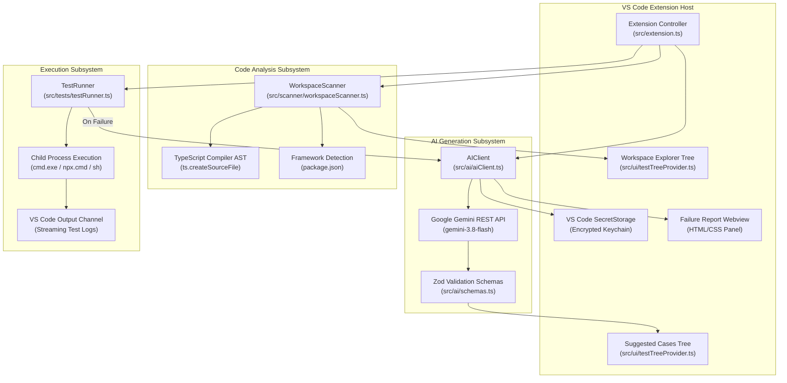

# AI Codebase-Aware Testing Assistant for VS Code

[](https://www.typescriptlang.org/)
[](https://code.visualstudio.com/)
[](https://vitest.dev/)
[](https://playwright.dev/)
[](https://jestjs.io/)
[](https://ai.google.dev/)
[]()

An intelligent, codebase-aware Visual Studio Code extension that analyzes your project structure using the TypeScript Abstract Syntax Tree (AST), identifies testable functions, generates structured test scenarios (positive, negative, edge, and security), writes executable test code (Vitest, Playwright, Jest), executes test suites in isolated child processes, and diagnoses test failures with automated AI root-cause analysis.

---

## Table of Contents

1. [Key Features](#-key-features)
2. [Architecture Overview](#-architecture-overview)
3. [Deep Codebase Explanation (How the Code Works)](#-deep-codebase-explanation-how-the-code-works)
   - [1. Extension Entrypoint (`src/extension.ts`)](#1-extension-entrypoint-srcextensionts)
   - [2. Workspace Scanner (`src/scanner/workspaceScanner.ts`)](#2-workspace-scanner-srcscannerworkspacescannerts)
   - [3. AI Engine & SecretStorage (`src/ai/aiClient.ts`)](#3-ai-engine--secretstorage-srcaiaiclientts)
   - [4. Schema Contracts (`src/ai/schemas.ts`)](#4-schema-contracts-srcaischemasts)
   - [5. Test Runner & Log Parsing (`src/tests/testRunner.ts`)](#5-test-runner--log-parsing-srcteststestrunnerts)
   - [6. Sidebar Tree UI (`src/ui/testTreeProvider.ts`)](#6-sidebar-tree-ui-srcuitesttreeproviderts)
4. [Cross-Platform & Windows Compatibility Guide](#-cross-platform--windows-compatibility-guide)
5. [Step-by-Step Instructions to Test & Run](#-step-by-step-instructions-to-test--run)
   - [Prerequisites](#prerequisites)
   - [Quick Start](#quick-start)
   - [Testing End-to-End with Sample App](#testing-end-to-end-with-sample-app)
6. [Extension Configuration & Commands](#-extension-configuration--commands)
7. [Troubleshooting & FAQ](#-troubleshooting--faq)
8. [Supplementary Documentation](#-supplementary-documentation)

---

## 🌟 Key Features

- **TypeScript AST-Driven Code Scanner**: Performs AST traversal using the TypeScript Compiler API (`ts.createSourceFile`) to discover exported functions, arrow functions, and class methods along with parameter signatures and return types.
- **Framework Detection**: Inspects project configuration (`package.json`) to detect installed web frameworks (Next.js, React, Express, NestJS, Vue) and testing runners (Vitest, Playwright, Jest).
- **Changed-Code Impact Analysis**: Inspects git status to map modified files to discovered functions and identifies impacted test suites.
- **Automatic Test Selection**: Execute *only* the test suites covering modified code, accelerating feedback loops.
- **Interactive UI Tree Views**: Displays discovered source files, functions, existing test files, and generated test scenarios directly inside the VS Code Activity Bar sidebar.
- **Test Quality Scoring**: Awards a 0–100 quality score and letter grade (`A+`, `A`, `B`, `C`) evaluating scenario diversity, edge case coverage, and assertion clarity.
- **Requirement Traceability Matrix**: Automatically links requirements (`REQ-001`) to functions and generates `docs/TRACEABILITY_MATRIX.md`.
- **Secure Credential Storage**: Uses VS Code's native `SecretStorage` API (`context.secrets`) to securely store and retrieve Gemini API keys without saving secrets to disk or config files.
- **Structured Test Case Generation**: Produces categorized test scenarios (`positive`, `negative`, `edge`, `security`) with inputs, expected results, and priority levels validated via Zod schemas.
- **Selective Approval Workflow**: Review, approve, or toggle individual test cases in the sidebar before generating actual test code.
- **Automated Test Code Synthesis**: Generates ready-to-execute test files using modern framework syntax (Vitest, Playwright, Jest) and writes them into `tests/ai-generated/`.
- **Integrated Test Execution**: Runs tests directly from VS Code via child process execution, streaming output to a dedicated Output Channel and parsing pass/fail metrics.
- **Better Failure Classification**: Classifies failures into `AssertionError`, `TimeoutError`, `TypeError`, `ReferenceError`, and `CompilationError`.
- **AI Root Cause Failure Diagnostics**: In the event of test failures, analyzes the stack trace and source code, producing an interactive Webview with root cause hypotheses, line numbers, and actionable remediation steps.
- **🐛 1-Click Defect Report Export**: Exports standardized bug reports (`defects/BUG-XXXXXX.md`) ready for GitHub Issues or Jira.
- **✨ Self-Healing Test Auto-Repair**: Automated repair of failing tests, updating assertions and mocks to match implementation with one click.

---

## 🏗️ Architecture Overview

The extension follows a decoupled, event-driven modular architecture:



---

## 🔍 Deep Codebase Explanation (How the Code Works)

### 1. Extension Entrypoint (`src/extension.ts`)

[src/extension.ts](file:///g:/vs_code-qa-extention/src/extension.ts) orchestrates all extension capabilities, registering commands, binding tree views, and handling user interactions.

- **`activate(context: vscode.ExtensionContext)`**:
  - Initializes the output channel (`"AI Testing Assistant"`).
  - Obtains the current workspace root path (`vscode.workspace.workspaceFolders[0].uri.fsPath`).
  - Instantiates `WorkspaceScanner`, `AIClient`, `TestRunner`, and tree providers (`WorkspaceTreeProvider`, `SuggestedCasesTreeProvider`).
  - Registers the sidebar views (`aiTestingExplorer` and `aiTestingSuggestedCases`).
  - Registers all user commands:
    - `aiTesting.setApiKey`: Prompts for Google Gemini API key and saves it to `context.secrets`.
    - `aiTesting.scanProject`: Runs project-wide AST scan and updates sidebar.
    - `aiTesting.analyzeCurrentFile`: Extracts functions from active editor file and allows quick-pick selection.
    - `aiTesting.generateTestCases`: Triggers AI scenario generation for a selected function.
    - `aiTesting.toggleApproval`: Toggles checkbox approval on a test case tree item.
    - `aiTesting.approveAndGenerateCode`: Writes executable test code for approved test cases to disk.
    - `aiTesting.runTests`: Executes tests in child process and optionally launches AI root cause diagnostics.
- **Path Sanitization & Cross-Platform File Writing**:
  - In `approveAndGenerateCode`, AI-suggested test file paths are sanitized:
    ```typescript
    let cleanRelativePath = generated.suggestedTestFilePath.trim()
      .replace(/^[a-zA-Z]:[/\\]*/, "") // Strips Windows drive letters (C:, D:)
      .replace(/^[\/\\]+/, "");         // Strips leading slashes
    ```
  - Verifies that `path.resolve(workspaceRoot, cleanRelativePath)` stays inside `workspaceRoot` to prevent path traversal.
  - Automatically creates parent directories (`fs.mkdir(..., { recursive: true })`) and opens the generated test in the editor.

---

### 2. Workspace Scanner (`src/scanner/workspaceScanner.ts`)

[src/scanner/workspaceScanner.ts](file:///g:/vs_code-qa-extention/src/scanner/workspaceScanner.ts) inspects project dependencies and extracts functions using the TypeScript AST parser.

- **`scanProject(): Promise<ProjectAnalysis>`**:
  - Calls `vscode.workspace.findFiles("**/*.{ts,tsx,js,jsx}", "**/node_modules/**...")` to find all source code.
  - Detects if each file is a test file using `isTestFile()` (checking for `.test.`, `.spec.`, `tests/`, `__tests__/`).
  - Iterates over each file, reads its content via `fs.readFile`, and parses functions with `extractFunctionsFromSource()`.
- **AST Parsing Mechanism (`extractFunctionsFromSource`)**:
  - Creates a TypeScript AST representation:
    ```typescript
    const sourceFile = ts.createSourceFile(
      path.basename(filePath),
      sourceText,
      ts.ScriptTarget.Latest,
      true
    );
    ```
  - Recursively traverses AST nodes using `ts.forEachChild(node, visit)`:
    1. **Function Declarations**: Identifies `ts.isFunctionDeclaration(node)`. Extracts name, parameter list, return type, export modifier, start/end line numbers, and the raw code snippet.
    2. **Arrow & Expression Functions**: Identifies `ts.isVariableStatement(node)` containing `ts.isArrowFunction()` or `ts.isFunctionExpression()`.
    3. **Class Methods**: Identifies `ts.isMethodDeclaration(node)` on classes.
- **Framework Detection (`detectFrameworks`)**:
  - Parses `package.json` dependencies and devDependencies.
  - Identifies frameworks: Next.js, React, Express, NestJS, Vue.
  - Identifies test runners: `@playwright/test` (Playwright), `vitest` (Vitest), `jest` (Jest).

---

### 3. AI Engine & SecretStorage (`src/ai/aiClient.ts`)

[src/ai/aiClient.ts](file:///g:/vs_code-qa-extention/src/ai/aiClient.ts) connects the extension to Google's Gemini models using direct HTTPS REST calls, enforcing structured JSON output.

- **Secure Key Storage**:
  - `setApiKey(apiKey)` and `getApiKey()` interface with `context.secrets` (`aiTesting.geminiApiKey`).
  - `ensureApiKey()` prompts the user if no key is currently saved.
- **AI Test Case Generation (`generateTestCases`)**:
  - Normalizes file paths to POSIX slashes (`func.filePath.replace(/\\/g, "/")`) to prevent unescaped backslashes from breaking JSON prompts on Windows.
  - Enforces JSON output matching `TestCaseBatchSchema`.
  - Parses and validates responses with `zod`.
- **AI Code Generation (`generateTestCode`)**:
  - Sends the function snippet, framework choice, and approved scenarios to Gemini.
  - Returns framework-specific import statements, test fixtures, and complete test suites.
- **Failure Analysis (`analyzeFailure`)**:
  - When tests fail, passes the failing test output, stack trace, and relevant source function snippet to Gemini.
  - Returns a structured diagnostic report with probable cause, offending file/line, evidence, and recommended remediation.
- **Direct REST Integration (`callGeminiApi`)**:
  - Directly calls Google Gemini REST endpoint (`v1beta/models/{model}:generateContent?key={apiKey}`).
  - Uses `generationConfig: { temperature: 0.2, responseMimeType: "application/json" }` for deterministic and syntax-valid JSON responses.

---

### 4. Schema Contracts (`src/ai/schemas.ts`)

[src/ai/schemas.ts](file:///g:/vs_code-qa-extention/src/ai/schemas.ts) defines strict runtime type validations using Zod.

- **`TestCaseSchema`**:
  - `id`: Unique identifier (e.g. `tc-1`).
  - `title`: Short scenario summary.
  - `type`: Category (`positive`, `negative`, `edge`, `security`).
  - `priority`: Urgency (`high`, `medium`, `low`).
  - `description`: Plain-English test scenario.
  - `inputConditions`: Specific inputs or mocks required.
  - `expectedResult`: Expected return values or assertions.
  - `approved`: Boolean flag managed by the UI tree view.
- **`GeneratedTestCodeSchema`**:
  - `framework`: Selected runner (`vitest`, `playwright`, `jest`).
  - `targetFile`: Source file being tested.
  - `suggestedTestFilePath`: Target output file path.
  - `code`: Synthesized TypeScript/JavaScript test code.
  - `imports`: Array of required dependency packages.
- **`FailureAnalysisSchema`**:
  - `testName`, `likelyCause`, `relevantSourceFile`, `relevantLine`, `evidence`, `suggestedFix`, `confidence`.

---

### 5. Test Runner & Log Parsing (`src/tests/testRunner.ts`)

[src/tests/testRunner.ts](file:///g:/vs_code-qa-extention/src/tests/testRunner.ts) manages test execution in child processes and extracts pass/fail metrics.

- **Cross-Platform Execution Model**:
  - Resolves binary commands appropriately:
    ```typescript
    const isWindows = process.platform === "win32";
    const npxCmd = isWindows ? "npx.cmd" : "npx";
    ```
  - Dispatches commands through `child_process.exec`:
    ```typescript
    exec(command, {
      cwd: this.workspaceRoot,
      windowsHide: true,
      maxBuffer: 10 * 1024 * 1024, // 10MB buffer prevents truncation
      shell: isWindows ? (process.env.ComSpec || "cmd.exe") : undefined
    }, (error, stdout, stderr) => { ... });
    ```
- **Log Parsing**:
  - Uses regular expressions (`/(\d+)\s+passed/i`, `/(\d+)\s+failed/i`) to determine test counts.
  - Captures the first failure snippet (locating `FAIL` markers or extracting stderr) to feed into the failure analysis engine.

---

### 6. Sidebar Tree UI (`src/ui/testTreeProvider.ts`)

[src/ui/testTreeProvider.ts](file:///g:/vs_code-qa-extention/src/ui/testTreeProvider.ts) implements VS Code `TreeDataProvider` interfaces for interactive explorer panels.

- **`WorkspaceTreeProvider` (`aiTestingExplorer`)**:
  - Root nodes: Project framework badge, Scanned Source Files, and Existing Tests.
  - Clicking on any discovered function invokes `vscode.open` and immediately jumps cursor to `startLine`.
  - Clicking on existing tests opens the test file.
  - Formats paths with forward slashes for clean presentation on all operating systems.
- **`SuggestedCasesTreeProvider` (`aiTestingSuggestedCases`)**:
  - Displays generated test scenarios grouped under the active function header.
  - Status icons: `pass-filled` for approved cases, `circle-large-outline` for unapproved cases.
  - Clicking a test item toggles its approval state.
  - Provides `approveAll()` helper for batch approval.

---

## 💻 Cross-Platform & Windows Compatibility Guide

The project is fully engineered and tested to work seamlessly on **Windows 10/11**, **macOS**, and **Linux**.

### Windows Specifics Handled in Code:
1. **PowerShell Execution Policy**:
   On Windows, PowerShell by default blocks script execution (`.ps1`), which can prevent `npm` from loading (`PSSecurityException`). To configure PowerShell for current user development:
   ```powershell
   Set-ExecutionPolicy -Scope CurrentUser -ExecutionPolicy RemoteSigned -Force
   ```
2. **Batch Script Invocation (`npx.cmd`)**:
   On Windows, executing `npx` via child process without `.cmd` can cause `cmd.exe` or PowerShell to fail. The extension dynamically uses `npx.cmd` and sets `ComSpec` shell on Windows.
3. **Path Separation & Normalization**:
   Windows uses backslashes (`\`) for file system paths, which can break JSON interpolation or regex pattern matching. The extension converts paths to POSIX format (`replace(/\\/g, "/")`) before sending them to the Gemini API or displaying them in the sidebar tree.
4. **Drive Letter Sanitization**:
   Windows drive letters (e.g. `C:`, `G:`) generated in AI suggested file paths are stripped before calling `path.resolve` to avoid escaping the workspace root.
5. **File Locking & Permissions**:
   Windows throws `EPERM` or `EBUSY` when files are locked by another process. The extension catches these codes and provides actionable error notifications.

---

## 🧪 Step-by-Step Instructions to Test & Run

### Prerequisites
- [Node.js](https://nodejs.org/) v18.0.0 or higher (v20+ recommended).
- [VS Code](https://code.visualstudio.com/) v1.85.0 or higher.
- A [Google Gemini API Key](https://aistudio.google.com/app/apikey).

### Quick Start

1. **Clone and open repository**:
   ```bash
   git clone https://github.com/rasinduchandumina/vs_code-qa-extention.git
   cd vs_code-qa-extention
   ```
2. **Install extension dependencies**:
   ```bash
   npm install
   ```
3. **Compile the extension**:
   ```bash
   npm run compile
   ```
   *(Or keep `npm run watch` running in a separate terminal during development).*

4. **Launch Extension Development Host**:
   - Press **`F5`** in VS Code (or choose **Run and Debug** -> **Run Extension**).
   - A new VS Code window titled `[Extension Development Host]` will open.

---

### Testing End-to-End with Sample App

A ready-to-test sample project is included in [`examples/sample-app`](file:///g:/vs_code-qa-extention/examples/sample-app).

#### Step 1: Open Sample App in Extension Host
In the `[Extension Development Host]` window:
- Click **File > Open Folder...** and select `g:\vs_code-qa-extention\examples\sample-app`.

#### Step 2: Open AI Testing Sidebar
- Click the **AI Testing** icon on the Activity Bar (left navigation rail).
- You will see two panels: **Testing Workspace Explorer** and **AI Suggested Test Cases**.

#### Step 3: Configure Gemini API Key
- Press `Ctrl+Shift+P` (or `Cmd+Shift+P` on macOS) to open the Command Palette.
- Run: `AI Testing: Configure Gemini API Key`.
- Paste your Gemini API key. VS Code securely stores this in your OS keychain.

#### Step 4: Scan Project Codebase
- In the sidebar, click the scan icon or run from Command Palette: `AI Testing: Scan Project Structure`.
- The notification will display:
  `Scanned 2 source files. Found 3 functions and 1 existing tests.`
- Expand **Scanned Source Files**:
  - `src/cart.ts` (contains `calculateTotal`, `applyDiscount`)
  - `src/auth.ts` (contains `loginUser`)
- Click on `calculateTotal` — VS Code will open `src/cart.ts` directly at line 17!

#### Step 5: Generate Test Cases for Function
- Right-click or select `calculateTotal` and click **Generate Test Cases for Function** (or run `AI Testing: Generate Test Cases for Function`).
- The AI generates scenarios under **AI Suggested Test Cases**:
  - Positive tests (e.g. standard items with default tax).
  - Negative tests (e.g. invalid negative price or quantity).
  - Edge cases (e.g. empty cart array).
  - Security / Boundary tests (e.g. zero tax rate, precision limits).

#### Step 6: Approve Scenarios & Generate Test Code
- Click individual test case items in the sidebar to toggle approval (the icon switches from outline circle to filled checkmark).
- In the title menu of **AI Suggested Test Cases**, click the checkmark button or run command: `AI Testing: Approve & Generate Test Code`.
- The extension contacts Gemini, synthesizes the complete test file, writes it to:
  `tests/ai-generated/calculateTotal.test.ts`
  and opens the generated test file in your editor!

#### Step 7: Run Automated Tests
- Run `AI Testing: Run Automated Tests` from the Command Palette or click the Play icon in the sidebar.
- The **AI Testing Assistant** output channel will open, showing live execution logs from Vitest.
- Notification: `All X tests passed successfully!`.

#### Step 8: Test AI Root Cause Failure Diagnostics
- Open `examples/sample-app/src/cart.ts` and deliberately break a calculation (e.g. change `return Number((subtotal + tax).toFixed(2));` to `return 999;`).
- Run `AI Testing: Run Automated Tests`.
- A failure dialog appears: `Tests failed (1 failures). Would you like AI Failure Analysis?`.
- Click **Analyze Failure**.
- An interactive Webview opens beside your code showing:
  - **Likely Root Cause**
  - **Relevant File & Line Number**
  - **Confidence Level**
  - **Suggested Fix / Action**
  - **Extracted Stack Trace Evidence**

---

## ⚙️ Extension Configuration & Commands

### Settings (`settings.json`)

| Setting Key | Default | Options | Description |
|-------------|---------|---------|-------------|
| `aiTesting.model` | `"gemini-3.8-flash"` | `"gemini-3.8-flash"`, `"gemini-3.5-flash-lite"`, `"gemini-3.7-flash"`, `"gemini-2.5-flash"`, `"gemini-2.0-flash"`, `"gemini-1.5-flash"` | Active Google Gemini model. Automatic fallback cascades if primary model is unavailable. |
| `aiTesting.testFramework` | `"vitest"` | `"vitest"`, `"playwright"`, `"jest"` | Target test execution framework. |
| `aiTesting.testDirectory` | `"tests/ai-generated"` | string | Workspace directory where generated test files are created. |

### Commands

| Command | Title | Category | Description |
|---------|-------|----------|-------------|
| `aiTesting.scanProject` | Scan Project Structure | AI Testing | Scans workspace with TypeScript AST and lists files/functions. |
| `aiTesting.analyzeCurrentFile` | Analyze Current File | AI Testing | Lists functions in active file for quick-pick test generation. |
| `aiTesting.generateTestCases` | Generate Test Cases for Function | AI Testing | Prompts AI to generate structured test cases for target function. |
| `aiTesting.setApiKey` | Configure Gemini API Key | AI Testing | Prompts and stores API key in VS Code SecretStorage. |
| `aiTesting.selectModel` | Switch Gemini Model | AI Testing | Interactive quick-pick to switch active Gemini model. |
| `aiTesting.analyzeImpact` | Analyze Changed Code Impact | AI Testing | Analyzes git modifications and maps impacted functions/tests. |
| `aiTesting.runImpactedTests` | Run Impacted Tests Only | AI Testing | Selects and executes only the test suites covering modified code. |
| `aiTesting.generateTraceabilityMatrix` | Generate Traceability Matrix | AI Testing | Synthesizes Requirement → Function → Test matrix into `docs/`. |
| `aiTesting.exportDefectReport` | Export Defect Report | AI Testing | Generates standardized defect file (`defects/BUG-XXXXXX.md`). |
| `aiTesting.repairFailingTest` | Auto-Repair Failing Test | AI Testing | AI analyzes failing test, repairs test code, and updates file. |
| `aiTesting.runTests` | Run Automated Tests | AI Testing | Executes test suite in child process and reports results. |
| `aiTesting.toggleApproval` | Toggle Approval | AI Testing | Toggles approval state of a suggested test case. |
| `aiTesting.approveAndGenerateCode` | Approve & Generate Test Code | AI Testing | Writes test suite code for approved cases to disk. |

---

## ❓ Troubleshooting & FAQ

### Q: `npm : File ... cannot be loaded because running scripts is disabled on this system.`
**Solution**: This is caused by Windows PowerShell's default script execution policy. Run this command in PowerShell:
```powershell
Set-ExecutionPolicy -Scope CurrentUser -ExecutionPolicy RemoteSigned -Force
```

### Q: `'tsc' is not recognized as an internal or external command`
**Solution**: Run `npm install` in the project root to install TypeScript into `node_modules`.

### Q: Tests fail with `No test suite found in file ...`
**Solution**: In TypeScript test suites running under Vitest, ensure `typescript` is installed in `devDependencies` of the target project (`npm install -D typescript`).

### Q: Gemini API Key returns 400 or 403 error
**Solution**: Ensure your key is valid and has active access to Gemini API from Google AI Studio. Re-enter it via `AI Testing: Configure Gemini API Key`.

### Q: Gemini API returns `503: This model is currently experiencing high demand`
**Solution**: The extension automatically applies exponential backoff retries and switches to fallback models (`gemini-3.5-flash-lite`, `gemini-2.5-flash`, etc.). You can also switch models at any time by running `AI Testing: Switch Gemini Model` from the Command Palette or clicking **Switch Model** on the error dialog.

---

## 📚 Supplementary Documentation

- 🏛️ [Architecture Deep-Dive (`docs/ARCHITECTURE.md`)](file:///g:/vs_code-qa-extention/docs/ARCHITECTURE.md): Comprehensive system design, AST parsing details, schema specifications, and failure analysis pipelines.
- 📋 [Comprehensive Testing Guide (`docs/TESTING_GUIDE.md`)](file:///g:/vs_code-qa-extention/docs/TESTING_GUIDE.md): Complete test matrix, QA test scenarios, validation checklists, and mock test procedures.
- 📦 [Sample Shop Application (`examples/sample-app/README.md`)](file:///g:/vs_code-qa-extention/examples/sample-app/README.md): Documentation for the included testing sandbox application.
