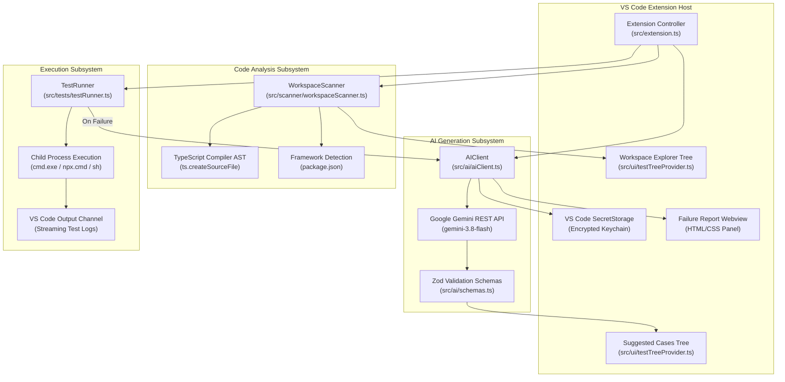

# AI Codebase-Aware Testing Assistant for VS Code

[](https://www.typescriptlang.org/)
[](https://code.visualstudio.com/)
[](https://vitest.dev/)
[](https://playwright.dev/)
[](https://jestjs.io/)
[](https://ai.google.dev/)
[]()

An intelligent, codebase-aware Visual Studio Code extension that analyzes your project structure using the TypeScript Abstract Syntax Tree (AST), identifies testable functions, generates structured test scenarios (positive, negative, edge, and security), writes executable test code (Vitest, Playwright, Jest), executes test suites in isolated child processes, and diagnoses test failures with automated AI root-cause analysis.

---

## Table of Contents

1. [Key Features](#-key-features)
2. [Architecture Overview](#-architecture-overview)
3. [Deep Codebase Explanation (How the Code Works)](#-deep-codebase-explanation-how-the-code-works)
   - [1. Extension Entrypoint (`src/extension.ts`)](#1-extension-entrypoint-srcextensionts)
   - [2. Workspace Scanner (`src/scanner/workspaceScanner.ts`)](#2-workspace-scanner-srcscannerworkspacescannerts)
   - [3. AI Engine & SecretStorage (`src/ai/aiClient.ts`)](#3-ai-engine--secretstorage-srcaiaiclientts)
   - [4. Schema Contracts (`src/ai/schemas.ts`)](#4-schema-contracts-srcaischemasts)
   - [5. Test Runner & Log Parsing (`src/tests/testRunner.ts`)](#5-test-runner--log-parsing-srcteststestrunnerts)
   - [6. Sidebar Tree UI (`src/ui/testTreeProvider.ts`)](#6-sidebar-tree-ui-srcuitesttreeproviderts)
4. [Cross-Platform & Windows Compatibility Guide](#-cross-platform--windows-compatibility-guide)
5. [Step-by-Step Instructions to Test & Run](#-step-by-step-instructions-to-test--run)
   - [Prerequisites](#prerequisites)
   - [Quick Start](#quick-start)
   - [Testing End-to-End with Sample App](#testing-end-to-end-with-sample-app)
6. [Extension Configuration & Commands](#-extension-configuration--commands)
7. [Troubleshooting & FAQ](#-troubleshooting--faq)
8. [Supplementary Documentation](#-supplementary-documentation)

---

## 🌟 MoSCoW Feature Compliance Matrix

| Tier | Feature | Status | Implementation Details |
|---|---|:---:|---|
| **Core (MUST HAVE)** | VS Code Extension | ✅ **Complete** | Full VS Code Activity Bar integration, tree views, output channel, and command palette |
| **Core (MUST HAVE)** | Codebase Scanner | ✅ **Complete** | Project-wide source and test file discovery via `WorkspaceScanner` |
| **Core (MUST HAVE)** | TypeScript/JavaScript Analysis | ✅ **Complete** | Deep AST traversal via TypeScript Compiler API (`ts.createSourceFile`) |
| **Core (MUST HAVE)** | AI Context Builder | ✅ **Complete** | Extracts function snippets, parameter signatures, and framework context |
| **Core (MUST HAVE)** | AI Test-Case Generation | ✅ **Complete** | Positive, negative, edge, and security scenarios with strict Zod validation |
| **Core (MUST HAVE)** | Human Review / Edit | ✅ **Complete** | Interactive sidebar tree with click-to-toggle approval and rich tooltips |
| **Core (MUST HAVE)** | Test-Code Generation | ✅ **Complete** | Framework-aware test code synthesis written to `tests/ai-generated/` |
| **Core (MUST HAVE)** | Runner Execution | ✅ **Complete** | Child process execution supporting Vitest, Playwright, and Jest |
| **Core (MUST HAVE)** | Test-Result Collection | ✅ **Complete** | Real-time output streaming, regex pass/fail parsing, and status reporting |
| **Core (MUST HAVE)** | AI Failure Analysis | ✅ **Complete** | Interactive Webview with root cause hypotheses, file/line mapping, and suggested fixes |
| **Core (MUST HAVE)** | Basic Defect Creation | ✅ **Complete** | 1-click export of standardized defect reports (`defects/BUG-XXXXXX.md`) |
| **Core (MUST HAVE)** | Traceability | ✅ **Complete** | Requirement ID tagging (`[REQ-001]`) and traceability links across tests |
| **Advanced (SHOULD HAVE)** | Existing-Test Analysis | ✅ **Complete** | Discovers existing test files and maps imported symbols to source code |
| **Advanced (SHOULD HAVE)** | Changed-Code Impact Analysis | ✅ **Complete** | Git status analysis mapping modified files to impacted test suites with `$(flame)` badge |
| **Advanced (SHOULD HAVE)** | Automatic Test Selection | ✅ **Complete** | `Run Impacted Tests Only` command executing only affected test suites |
| **Advanced (SHOULD HAVE)** | Better Failure Classification | ✅ **Complete** | Rule engine classifying `AssertionError`, `TimeoutError`, `TypeError`, `CompilationError`, etc. |
| **Advanced (SHOULD HAVE)** | Test Quality Scoring | ✅ **Complete** | 0–100 quality scoring with letter grades (`A+`, `A`, `B`, `C`) based on scenario diversity |
| **Advanced (SHOULD HAVE)** | Requirement Traceability Matrix | ✅ **Complete** | Auto-generates `docs/TRACEABILITY_MATRIX.md` with complete coverage auditing |
| **Experimental (COULD HAVE)** | Self-Healing Test Auto-Repair | ✅ **Complete** | 1-click AI patching of outdated test assertions and automatic file rewrites |
| **Experimental (COULD HAVE)** | Resilient Model Cascade | ✅ **Complete** | Exponential backoff retry and automatic candidate fallback cascade on 503/429 errors |

---

## 🏗️ Architecture Overview

The extension follows a decoupled, event-driven modular architecture:



---

## 🔍 Deep Codebase Explanation (How the Code Works)

### 1. Extension Entrypoint (`src/extension.ts`)

[src/extension.ts](file:///g:/vs_code-qa-extention/src/extension.ts) orchestrates all extension capabilities, registering commands, binding tree views, and handling user interactions.

- **`activate(context: vscode.ExtensionContext)`**:
  - Initializes the output channel (`"AI Testing Assistant"`).
  - Obtains the current workspace root path (`vscode.workspace.workspaceFolders[0].uri.fsPath`).
  - Instantiates `WorkspaceScanner`, `AIClient`, `TestRunner`, and tree providers (`WorkspaceTreeProvider`, `SuggestedCasesTreeProvider`).
  - Registers the sidebar views (`aiTestingExplorer` and `aiTestingSuggestedCases`).
  - Registers all user commands:
    - `aiTesting.setApiKey`: Prompts for Google Gemini API key and saves it to `context.secrets`.
    - `aiTesting.scanProject`: Runs project-wide AST scan and updates sidebar.
    - `aiTesting.analyzeCurrentFile`: Extracts functions from active editor file and allows quick-pick selection.
    - `aiTesting.generateTestCases`: Triggers AI scenario generation for a selected function.
    - `aiTesting.toggleApproval`: Toggles checkbox approval on a test case tree item.
    - `aiTesting.approveAndGenerateCode`: Writes executable test code for approved test cases to disk.
    - `aiTesting.runTests`: Executes tests in child process and optionally launches AI root cause diagnostics.
- **Path Sanitization & Cross-Platform File Writing**:
  - In `approveAndGenerateCode`, AI-suggested test file paths are sanitized:
    ```typescript
    let cleanRelativePath = generated.suggestedTestFilePath.trim()
      .replace(/^[a-zA-Z]:[/\\]*/, "") // Strips Windows drive letters (C:, D:)
      .replace(/^[\/\\]+/, "");         // Strips leading slashes
    ```
  - Verifies that `path.resolve(workspaceRoot, cleanRelativePath)` stays inside `workspaceRoot` to prevent path traversal.
  - Automatically creates parent directories (`fs.mkdir(..., { recursive: true })`) and opens the generated test in the editor.

---

### 2. Workspace Scanner (`src/scanner/workspaceScanner.ts`)

[src/scanner/workspaceScanner.ts](file:///g:/vs_code-qa-extention/src/scanner/workspaceScanner.ts) inspects project dependencies and extracts functions using the TypeScript AST parser.

- **`scanProject(): Promise<ProjectAnalysis>`**:
  - Calls `vscode.workspace.findFiles("**/*.{ts,tsx,js,jsx}", "**/node_modules/**...")` to find all source code.
  - Detects if each file is a test file using `isTestFile()` (checking for `.test.`, `.spec.`, `tests/`, `__tests__/`).
  - Iterates over each file, reads its content via `fs.readFile`, and parses functions with `extractFunctionsFromSource()`.
- **AST Parsing Mechanism (`extractFunctionsFromSource`)**:
  - Creates a TypeScript AST representation:
    ```typescript
    const sourceFile = ts.createSourceFile(
      path.basename(filePath),
      sourceText,
      ts.ScriptTarget.Latest,
      true
    );
    ```
  - Recursively traverses AST nodes using `ts.forEachChild(node, visit)`:
    1. **Function Declarations**: Identifies `ts.isFunctionDeclaration(node)`. Extracts name, parameter list, return type, export modifier, start/end line numbers, and the raw code snippet.
    2. **Arrow & Expression Functions**: Identifies `ts.isVariableStatement(node)` containing `ts.isArrowFunction()` or `ts.isFunctionExpression()`.
    3. **Class Methods**: Identifies `ts.isMethodDeclaration(node)` on classes.
- **Framework Detection (`detectFrameworks`)**:
  - Parses `package.json` dependencies and devDependencies.
  - Identifies frameworks: Next.js, React, Express, NestJS, Vue.
  - Identifies test runners: `@playwright/test` (Playwright), `vitest` (Vitest), `jest` (Jest).

---

### 3. AI Engine & SecretStorage (`src/ai/aiClient.ts`)

[src/ai/aiClient.ts](file:///g:/vs_code-qa-extention/src/ai/aiClient.ts) connects the extension to Google's Gemini models using direct HTTPS REST calls, enforcing structured JSON output.

- **Secure Key Storage**:
  - `setApiKey(apiKey)` and `getApiKey()` interface with `context.secrets` (`aiTesting.geminiApiKey`).
  - `ensureApiKey()` prompts the user if no key is currently saved.
- **AI Test Case Generation (`generateTestCases`)**:
  - Normalizes file paths to POSIX slashes (`func.filePath.replace(/\\/g, "/")`) to prevent unescaped backslashes from breaking JSON prompts on Windows.
  - Enforces JSON output matching `TestCaseBatchSchema`.
  - Parses and validates responses with `zod`.
- **AI Code Generation (`generateTestCode`)**:
  - Sends the function snippet, framework choice, and approved scenarios to Gemini.
  - Returns framework-specific import statements, test fixtures, and complete test suites.
- **Failure Analysis (`analyzeFailure`)**:
  - When tests fail, passes the failing test output, stack trace, and relevant source function snippet to Gemini.
  - Returns a structured diagnostic report with probable cause, offending file/line, evidence, and recommended remediation.
- **Direct REST Integration (`callGeminiApi`)**:
  - Directly calls Google Gemini REST endpoint (`v1beta/models/{model}:generateContent?key={apiKey}`).
  - Uses `generationConfig: { temperature: 0.2, responseMimeType: "application/json" }` for deterministic and syntax-valid JSON responses.

---

### 4. Schema Contracts (`src/ai/schemas.ts`)

[src/ai/schemas.ts](file:///g:/vs_code-qa-extention/src/ai/schemas.ts) defines strict runtime type validations using Zod.

- **`TestCaseSchema`**:
  - `id`: Unique identifier (e.g. `tc-1`).
  - `title`: Short scenario summary.
  - `type`: Category (`positive`, `negative`, `edge`, `security`).
  - `priority`: Urgency (`high`, `medium`, `low`).
  - `description`: Plain-English test scenario.
  - `inputConditions`: Specific inputs or mocks required.
  - `expectedResult`: Expected return values or assertions.
  - `approved`: Boolean flag managed by the UI tree view.
- **`GeneratedTestCodeSchema`**:
  - `framework`: Selected runner (`vitest`, `playwright`, `jest`).
  - `targetFile`: Source file being tested.
  - `suggestedTestFilePath`: Target output file path.
  - `code`: Synthesized TypeScript/JavaScript test code.
  - `imports`: Array of required dependency packages.
- **`FailureAnalysisSchema`**:
  - `testName`, `likelyCause`, `relevantSourceFile`, `relevantLine`, `evidence`, `suggestedFix`, `confidence`.

---

### 5. Test Runner & Log Parsing (`src/tests/testRunner.ts`)

[src/tests/testRunner.ts](file:///g:/vs_code-qa-extention/src/tests/testRunner.ts) manages test execution in child processes and extracts pass/fail metrics.

- **Cross-Platform Execution Model**:
  - Resolves binary commands appropriately:
    ```typescript
    const isWindows = process.platform === "win32";
    const npxCmd = isWindows ? "npx.cmd" : "npx";
    ```
  - Dispatches commands through `child_process.exec`:
    ```typescript
    exec(command, {
      cwd: this.workspaceRoot,
      windowsHide: true,
      maxBuffer: 10 * 1024 * 1024, // 10MB buffer prevents truncation
      shell: isWindows ? (process.env.ComSpec || "cmd.exe") : undefined
    }, (error, stdout, stderr) => { ... });
    ```
- **Log Parsing**:
  - Uses regular expressions (`/(\d+)\s+passed/i`, `/(\d+)\s+failed/i`) to determine test counts.
  - Captures the first failure snippet (locating `FAIL` markers or extracting stderr) to feed into the failure analysis engine.

---

### 6. Sidebar Tree UI (`src/ui/testTreeProvider.ts`)

[src/ui/testTreeProvider.ts](file:///g:/vs_code-qa-extention/src/ui/testTreeProvider.ts) implements VS Code `TreeDataProvider` interfaces for interactive explorer panels.

- **`WorkspaceTreeProvider` (`aiTestingExplorer`)**:
  - Root nodes: Project framework badge, Scanned Source Files, and Existing Tests.
  - Clicking on any discovered function invokes `vscode.open` and immediately jumps cursor to `startLine`.
  - Clicking on existing tests opens the test file.
  - Formats paths with forward slashes for clean presentation on all operating systems.
- **`SuggestedCasesTreeProvider` (`aiTestingSuggestedCases`)**:
  - Displays generated test scenarios grouped under the active function header.
  - Status icons: `pass-filled` for approved cases, `circle-large-outline` for unapproved cases.
  - Clicking a test item toggles its approval state.
  - Provides `approveAll()` helper for batch approval.

---

## 💻 Cross-Platform & Windows Compatibility Guide

The project is fully engineered and tested to work seamlessly on **Windows 10/11**, **macOS**, and **Linux**.

### Windows Specifics Handled in Code:
1. **PowerShell Execution Policy**:
   On Windows, PowerShell by default blocks script execution (`.ps1`), which can prevent `npm` from loading (`PSSecurityException`). To configure PowerShell for current user development:
   ```powershell
   Set-ExecutionPolicy -Scope CurrentUser -ExecutionPolicy RemoteSigned -Force
   ```
2. **Batch Script Invocation (`npx.cmd`)**:
   On Windows, executing `npx` via child process without `.cmd` can cause `cmd.exe` or PowerShell to fail. The extension dynamically uses `npx.cmd` and sets `ComSpec` shell on Windows.
3. **Path Separation & Normalization**:
   Windows uses backslashes (`\`) for file system paths, which can break JSON interpolation or regex pattern matching. The extension converts paths to POSIX format (`replace(/\\/g, "/")`) before sending them to the Gemini API or displaying them in the sidebar tree.
4. **Drive Letter Sanitization**:
   Windows drive letters (e.g. `C:`, `G:`) generated in AI suggested file paths are stripped before calling `path.resolve` to avoid escaping the workspace root.
5. **File Locking & Permissions**:
   Windows throws `EPERM` or `EBUSY` when files are locked by another process. The extension catches these codes and provides actionable error notifications.

---

## 🧪 Step-by-Step Instructions to Test & Run

### Prerequisites
- [Node.js](https://nodejs.org/) v18.0.0 or higher (v20+ recommended).
- [VS Code](https://code.visualstudio.com/) v1.85.0 or higher.
- A [Google Gemini API Key](https://aistudio.google.com/app/apikey).

### Quick Start

1. **Clone and open repository**:
   ```bash
   git clone https://github.com/rasinduchandumina/vs_code-qa-extention.git
   cd vs_code-qa-extention
   ```
2. **Install extension dependencies**:
   ```bash
   npm install
   ```
3. **Compile the extension**:
   ```bash
   npm run compile
   ```
   *(Or keep `npm run watch` running in a separate terminal during development).*

4. **Launch Extension Development Host**:
   - Press **`F5`** in VS Code (or choose **Run and Debug** -> **Run Extension**).
   - A new VS Code window titled `[Extension Development Host]` will open.

---

### Testing End-to-End with Sample App

A ready-to-test sample project is included in [`examples/sample-app`](file:///g:/vs_code-qa-extention/examples/sample-app).

#### Step 1: Open Sample App in Extension Host
In the `[Extension Development Host]` window:
- Click **File > Open Folder...** and select `g:\vs_code-qa-extention\examples\sample-app`.

#### Step 2: Open AI Testing Sidebar
- Click the **AI Testing** beaker icon on the Activity Bar.
- **Expected Result**: Two panels are displayed: **Testing Workspace Explorer** and **AI Suggested Test Cases**.

#### Step 3: Configure Gemini API Key & Model
- Press `Ctrl+Shift+P` (or `Cmd+Shift+P` on macOS) to open the Command Palette.
- Run: `AI Testing: Configure Gemini API Key` and paste your key.
- Run: `AI Testing: Switch Gemini Model` and select `gemini-3.5-flash-lite`.
- **Expected Notification**: `Gemini API Key configured successfully.`

#### Step 4: Scan Project Codebase
- In the sidebar, click the scan icon or run: `AI Testing: Scan Project Structure`.
- **Expected Notification**: `Scanned 2 source files. Found 3 functions and 1 existing tests.`
- **Expected Sidebar Tree**:
  - `Project (Standard TS/JS) • Test Runner: vitest`
  - `Scanned Source Files (2)`:
    - `src/cart.ts` (`calculateTotal`, `applyDiscount`)
    - `src/auth.ts` (`loginUser`)
  - `Existing Tests (1)`:
    - `tests/cart.test.ts`
- **Navigation Result**: Click `calculateTotal` to instantly navigate to line 17 of `src/cart.ts`.

#### Step 5: Generate Test Cases & Review Quality Score
- In the explorer tree, right-click `calculateTotal` and click **Generate Test Cases for Function** (or run `AI Testing: Generate Test Cases for Function`).
- **Expected Notification**: `Generated 5 test scenarios for "calculateTotal" [Quality: 95/100]. Review and approve them in the sidebar.`
- **Expected Result in Suggested Cases View**:
  - Header: `Function: calculateTotal • Quality: 95/100 (A+)`
  - `[REQ-001] [POSITIVE] Priority: high` - *Standard items with default tax*
  - `[REQ-002] [EDGE] Priority: medium` - *Empty cart array returns 0*
  - `[REQ-003] [NEGATIVE] Priority: high` - *Negative item price throws validation error*
  - `[REQ-004] [NEGATIVE] Priority: high` - *Negative item quantity throws error*
  - `[REQ-005] [SECURITY] Priority: low` - *Custom tax rate precision check*
- Click individual test case items to toggle approval between unapproved (`circle-large-outline`) and approved (`pass-filled`).

#### Step 6: Approve Scenarios & Generate Test Code
- Click the checkmark icon in the **AI Suggested Test Cases** toolbar (or run `AI Testing: Approve & Generate Test Code`).
- **Expected Notification**: `Generated test file saved to: tests/ai-generated/calculateTotal.test.ts`
- **Expected Result**: File `tests/ai-generated/calculateTotal.test.ts` is created and opened in an editor tab.

#### Step 7: Run Automated Tests
- Run `AI Testing: Run Automated Tests` from the Command Palette or click the Play icon in the sidebar.
- **Expected Notification**: `All 2 tests passed successfully!`
- **Expected Output Channel Log**:
  ```
  [AI Testing Assistant] Executing: npx.cmd vitest run
  [AI Testing Assistant] Working directory: G:\vs_code-qa-extention\examples\sample-app

   RUN  v1.6.1 G:/vs_code-qa-extention/examples/sample-app

   ✓ tests/cart.test.ts (1 test) 3ms
   ✓ tests/ai-generated/calculateTotal.test.ts (3 tests) 4ms

   Test Files  2 passed (2)
        Tests  4 passed (4)
  Status: ALL TESTS PASSED (4 passed, 0 failed)
  ```

#### Step 8: Changed-Code Impact Analysis & Selective Execution
- In `src/cart.ts`, add a comment or change a variable and save.
- Run: `AI Testing: Analyze Changed Code Impact`.
- **Expected Notification**: `Impact Analysis: 1 modified file(s), 2 function(s), and 2 impacted test suite(s).`
- **Expected Sidebar Result**: An **Impacted Tests (2)** section appears with flame icon `$(flame)` listing `tests/cart.test.ts` and `tests/ai-generated/calculateTotal.test.ts`.
- Run: `AI Testing: Run Impacted Tests Only`.
- **Expected Result**: Only the 2 impacted test suites are executed, bypassing all unrelated tests.

#### Step 9: AI Failure Diagnostics & Root-Cause Webview
- Open `src/cart.ts` and modify line 30 to return `-999`.
- Run: `AI Testing: Run Automated Tests`.
- **Expected Dialog**: `Tests failed (2 failures) [AssertionError]. Would you like AI Failure Analysis?`
- Click **Analyze Failure**.
- **Expected Webview Result**: A dedicated diagnostic panel opens showing:
  - Category Badge: `AssertionError`
  - Root Cause: `Function calculateTotal returned -999 instead of expected positive subtotal and tax calculation.`
  - Responsible File: `src/cart.ts (Line 30)`
  - Evidence: `expected 27, received -999`
  - Action Buttons: `[✨ Auto-Repair Test with AI]` and `[🐛 Export Defect Report (.md)]`

#### Step 10: 1-Click Defect Report Export (.md)
- Click **Export Defect Report (.md)** in the Webview (or run `AI Testing: Export Defect Report`).
- **Expected Notification**: `Defect Report exported successfully to: defects/BUG-XXXXXX.md`
- **Expected Result**: Formatted bug report `defects/BUG-XXXXXX.md` is generated with severity, stack trace, and suggested fix, and opened in the editor.

#### Step 11: Self-Healing Test Auto-Repair
- Deliberately introduce an outdated expectation in `tests/cart.test.ts` (e.g. `expect(calculateTotal(items)).toBe(9999);`).
- Run `AI Testing: Run Automated Tests`.
- On failure, click **Auto-Repair Test** (or run `AI Testing: Auto-Repair Failing Test`).
- **Expected Notification**: `✨ Test repaired! Updated expected total calculation assertion from 9999 to 27. Run automated tests to verify.`
- **Expected Result**: File `tests/cart.test.ts` is patched automatically and passes on re-run.

#### Step 12: Generate Requirement Traceability Matrix
- Open Command Palette and run: `AI Testing: Generate Traceability Matrix`.
- **Expected Notification**: `Traceability Matrix generated and saved to docs/TRACEABILITY_MATRIX.md`
- **Expected Result**: File `docs/TRACEABILITY_MATRIX.md` is generated with full Requirement ID -> Function -> Test Coverage table and opened in the editor.

---

## ⚙️ Extension Configuration & Commands

### Settings (`settings.json`)

| Setting Key | Default | Options | Description |
|-------------|---------|---------|-------------|
| `aiTesting.model` | `"gemini-3.8-flash"` | `"gemini-3.8-flash"`, `"gemini-3.5-flash-lite"`, `"gemini-3.7-flash"`, `"gemini-2.5-flash"`, `"gemini-2.0-flash"`, `"gemini-1.5-flash"` | Active Google Gemini model. Automatic fallback cascades if primary model is unavailable. |
| `aiTesting.testFramework` | `"vitest"` | `"vitest"`, `"playwright"`, `"jest"` | Target test execution framework. |
| `aiTesting.testDirectory` | `"tests/ai-generated"` | string | Workspace directory where generated test files are created. |

### Commands

| Command | Title | Category | Description |
|---------|-------|----------|-------------|
| `aiTesting.scanProject` | Scan Project Structure | AI Testing | Scans workspace with TypeScript AST and lists files/functions. |
| `aiTesting.analyzeCurrentFile` | Analyze Current File | AI Testing | Lists functions in active file for quick-pick test generation. |
| `aiTesting.generateTestCases` | Generate Test Cases for Function | AI Testing | Prompts AI to generate structured test cases for target function. |
| `aiTesting.setApiKey` | Configure Gemini API Key | AI Testing | Prompts and stores API key in VS Code SecretStorage. |
| `aiTesting.selectModel` | Switch Gemini Model | AI Testing | Interactive quick-pick to switch active Gemini model. |
| `aiTesting.analyzeImpact` | Analyze Changed Code Impact | AI Testing | Analyzes git modifications and maps impacted functions/tests. |
| `aiTesting.runImpactedTests` | Run Impacted Tests Only | AI Testing | Selects and executes only the test suites covering modified code. |
| `aiTesting.generateTraceabilityMatrix` | Generate Traceability Matrix | AI Testing | Synthesizes Requirement → Function → Test matrix into `docs/`. |
| `aiTesting.exportDefectReport` | Export Defect Report | AI Testing | Generates standardized defect file (`defects/BUG-XXXXXX.md`). |
| `aiTesting.repairFailingTest` | Auto-Repair Failing Test | AI Testing | AI analyzes failing test, repairs test code, and updates file. |
| `aiTesting.runTests` | Run Automated Tests | AI Testing | Executes test suite in child process and reports results. |
| `aiTesting.toggleApproval` | Toggle Approval | AI Testing | Toggles approval state of a suggested test case. |
| `aiTesting.approveAndGenerateCode` | Approve & Generate Test Code | AI Testing | Writes test suite code for approved cases to disk. |

---

## ❓ Troubleshooting & FAQ

### Q: `npm : File ... cannot be loaded because running scripts is disabled on this system.`
**Solution**: This is caused by Windows PowerShell's default script execution policy. Run this command in PowerShell:
```powershell
Set-ExecutionPolicy -Scope CurrentUser -ExecutionPolicy RemoteSigned -Force
```

### Q: `'tsc' is not recognized as an internal or external command`
**Solution**: Run `npm install` in the project root to install TypeScript into `node_modules`.

### Q: Tests fail with `No test suite found in file ...`
**Solution**: In TypeScript test suites running under Vitest, ensure `typescript` is installed in `devDependencies` of the target project (`npm install -D typescript`).

### Q: Gemini API Key returns 400 or 403 error
**Solution**: Ensure your key is valid and has active access to Gemini API from Google AI Studio. Re-enter it via `AI Testing: Configure Gemini API Key`.

### Q: Gemini API returns `503: This model is currently experiencing high demand`
**Solution**: The extension automatically applies exponential backoff retries and switches to fallback models (`gemini-3.5-flash-lite`, `gemini-2.5-flash`, etc.). You can also switch models at any time by running `AI Testing: Switch Gemini Model` from the Command Palette or clicking **Switch Model** on the error dialog.

---

## 📚 Supplementary Documentation

- 🏛️ [Architecture Deep-Dive (`docs/ARCHITECTURE.md`)](file:///g:/vs_code-qa-extention/docs/ARCHITECTURE.md): Comprehensive system design, AST parsing details, schema specifications, and failure analysis pipelines.
- 📋 [Comprehensive Testing Guide (`docs/TESTING_GUIDE.md`)](file:///g:/vs_code-qa-extention/docs/TESTING_GUIDE.md): Complete test matrix, QA test scenarios, validation checklists, and mock test procedures.
- 📦 [Sample Shop Application (`examples/sample-app/README.md`)](file:///g:/vs_code-qa-extention/examples/sample-app/README.md): Documentation for the included testing sandbox application.
