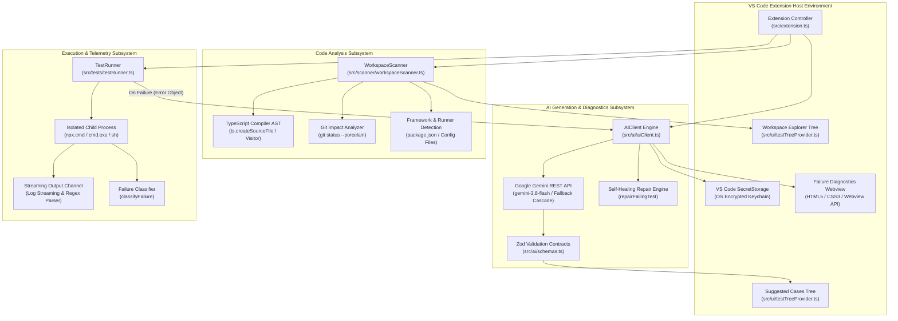
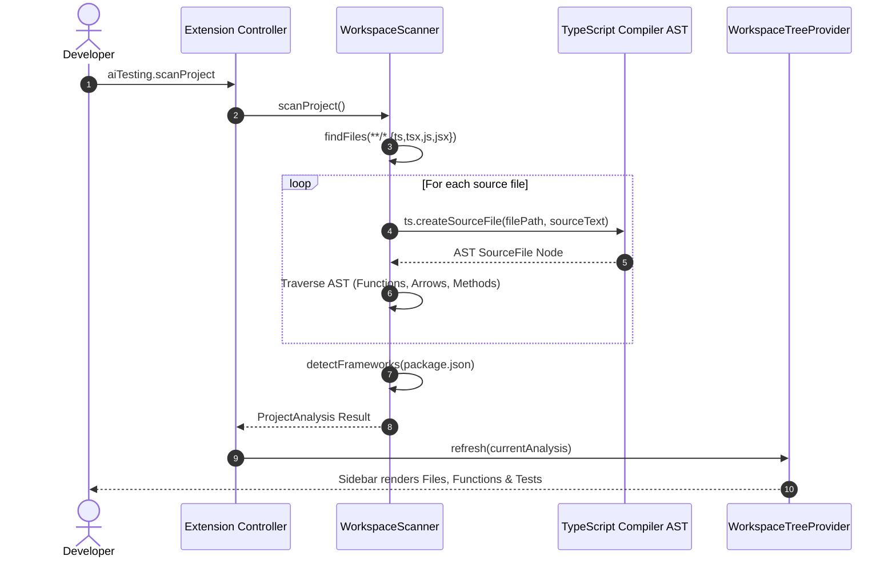
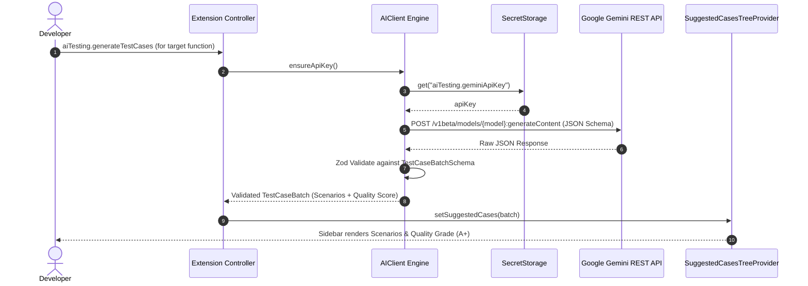
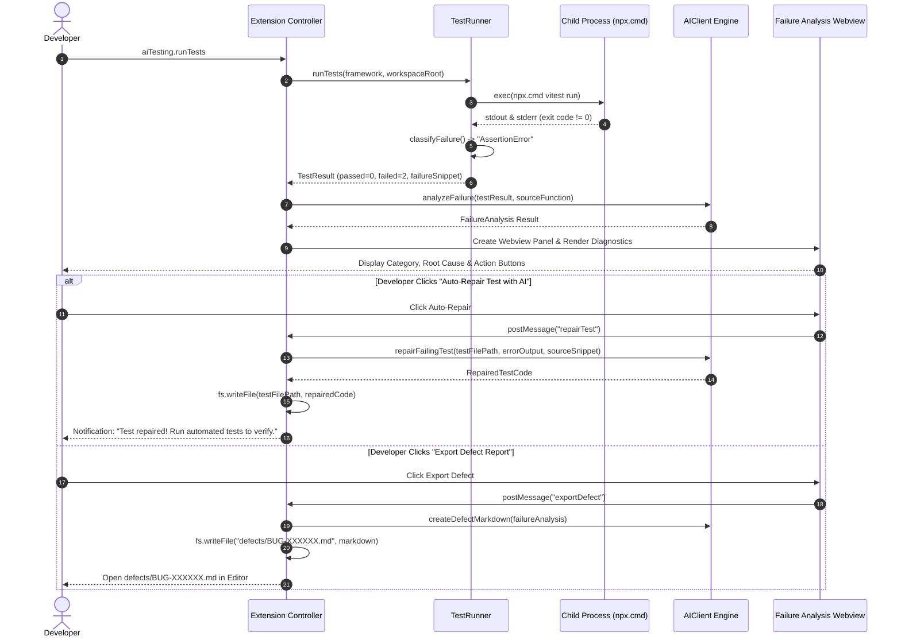

# System Architecture & Technical Design Specification

This document provides a comprehensive technical architecture and design specification for the **AI Codebase-Aware Testing Assistant** Visual Studio Code extension. It details the internal design, component interactions, AST parsing mechanisms, AI prompt engineering, process management models, and Windows cross-platform engineering.

---

## 1. High-Level Subsystem Architecture

The extension is architected as an event-driven, modular system partitioned into five decoupled subsystems:



---

## 2. Subsystem Deep-Dives & Implementation Mechanics

### 2.1 Extension Controller (`src/extension.ts`)

The controller acts as the central mediator between the VS Code host and the underlying subsystems:
- **Lifecycle Management**: Activates on workspace open; registers commands, status bar items, and tree view providers.
- **State Management**: Maintains runtime references:
  - `currentAnalysis`: Latest AST scan results (`ProjectAnalysis`).
  - `activeSelectedFunction`: Function currently selected for test generation.
  - `lastFailureAnalysis`: Structured failure analysis from recent test runs.
  - `lastFailingTestFile`: Absolute path to the most recently failed test file.
  - `lastFailureSnippet`: Raw error message, assertion failure, or stack trace.
- **Security & Secret Handling**: Uses `vscode.ExtensionContext.secrets` to securely manage the Google Gemini API key via the operating system's native keychain (Windows Credential Manager, macOS Keychain, Linux Secret Service).
- **Safe Cross-Platform Path Sanitization Pipeline**:
  When generating test code, the file path suggested by the LLM is strictly sanitized:
  ```typescript
  let cleanRelativePath = generated.suggestedTestFilePath.trim()
    .replace(/^[a-zA-Z]:[/\\]*/, "") // Strip Windows drive letters (C:, G:)
    .replace(/^[\/\\]+/, "");         // Strip leading slashes
  
  if (!cleanRelativePath.endsWith(".test.ts") && !cleanRelativePath.endsWith(".test.js")) {
    cleanRelativePath += ".test.ts";
  }

  const targetPath = path.resolve(workspaceRoot, cleanRelativePath);
  // Ensure the resolved path remains strictly within the workspace boundaries
  if (!targetPath.startsWith(path.resolve(workspaceRoot))) {
    throw new Error("Path traversal prevented: Target path escapes workspace.");
  }
  ```
  The extension ensures parent directories exist using `fs.mkdir(path.dirname(targetPath), { recursive: true })` and opens the generated test in the active editor.

---

### 2.2 Workspace Scanner & Impact Analysis (`src/scanner/workspaceScanner.ts`)

Instead of fragile regular expressions, the scanner uses the **TypeScript Compiler API** (`typescript`) to parse and traverse the source Abstract Syntax Tree (AST).

#### 1. AST Traversal Strategy
The scanner reads each source file from disk and parses it into an AST:
```typescript
const sourceFile = ts.createSourceFile(
  path.basename(filePath),
  sourceText,
  ts.ScriptTarget.Latest,
  true
);
```
A recursive visitor (`ts.forEachChild(node, visit)`) identifies:
- **Function Declarations**: `ts.isFunctionDeclaration(node)` — extracts function name, parameter types, return types, export status, and exact line boundaries.
- **Arrow Functions & Function Expressions**: `ts.isVariableStatement(node)` containing variable declarations initialized with `ts.isArrowFunction()` or `ts.isFunctionExpression()`.
- **Class Methods**: `ts.isMethodDeclaration(node)` — extracts member methods, visibility modifiers (public, private, protected), and parameter signatures.

#### 2. Framework & Runner Auto-Detection
The scanner parses `package.json` dependencies and devDependencies:
- **Test Runners**:
  - `vitest` -> Vitest runner (`npx vitest run`)
  - `@playwright/test` -> Playwright test runner (`npx playwright test`)
  - `jest` -> Jest test runner (`npx jest`)
- **Web Frameworks**:
  - `next` -> Next.js
  - `react` -> React
  - `express` -> Express.js
  - `@nestjs/core` -> NestJS
  - `vue` -> Vue.js

#### 3. Changed-Code Impact Analysis (`analyzeImpact`)
Accelerates test cycles by determining which test suites are affected by recent code modifications:
1. Executes `git status --porcelain` in the workspace root.
2. Extracts modified, added, or untracked source files (`.ts`, `.tsx`, `.js`, `.jsx`).
3. Maps modified files to discovered AST functions.
4. Cross-references target function names and imported symbols against existing test files.
5. Identifies `impactedTestFiles` and presents them in the sidebar with a flame badge (`$(flame)`).

#### 4. Requirement Traceability Matrix (`generateTraceabilityMatrix`)
Synthesizes a GitHub-flavored Markdown matrix (`docs/TRACEABILITY_MATRIX.md`):
- Assigns deterministic Requirement IDs (`REQ-001`, `REQ-002`, ...).
- Correlates each requirement with its target function, source file, kind, and test coverage status (✅ **Covered** or ⚠️ *Untested*).
- Outputs summary metrics for audit readiness.

---

### 2.3 AI Engine, Quality Scoring & Self-Healing (`src/ai/aiClient.ts`)

The AI engine interfaces directly with Google's Gemini models using HTTPS REST requests without heavy SDK dependencies.

#### 1. Structured JSON Enforcement
Prompts explicitly instruct the model to produce valid JSON adhering strictly to Zod schemas. The request payload specifies:
```json
"generationConfig": {
  "temperature": 0.2,
  "responseMimeType": "application/json"
}
```

#### 2. Zod Schema Contracts (`src/ai/schemas.ts`)
- **`TestCaseSchema`**:
  ```typescript
  export const TestCaseSchema = z.object({
    id: z.string(),
    reqId: z.string().optional(),
    title: z.string(),
    type: z.enum(["positive", "negative", "edge", "security"]),
    priority: z.enum(["high", "medium", "low"]),
    description: z.string(),
    inputConditions: z.string(),
    expectedResult: z.string(),
    approved: z.boolean().default(false)
  });
  ```
- **`TestCaseBatchSchema`**:
  ```typescript
  export const TestCaseBatchSchema = z.object({
    functionName: z.string(),
    summary: z.string(),
    qualityScore: z.number().min(0).max(100).default(85),
    qualityGrade: z.enum(["A+", "A", "B", "C"]).default("A"),
    scenarios: z.array(TestCaseSchema)
  });
  ```
- **`FailureAnalysisSchema`**:
  ```typescript
  export const FailureAnalysisSchema = z.object({
    testName: z.string(),
    category: z.enum([
      "AssertionError",
      "TimeoutError",
      "TypeError",
      "ReferenceError",
      "CompilationError",
      "RuntimeCrash"
    ]).default("AssertionError"),
    likelyCause: z.string(),
    relevantSourceFile: z.string(),
    relevantLine: z.number().optional(),
    evidence: z.string(),
    suggestedFix: z.string(),
    confidence: z.enum(["LOW", "MEDIUM", "HIGH"])
  });
  ```
- **`RepairedTestCodeSchema`**:
  ```typescript
  export const RepairedTestCodeSchema = z.object({
    testFilePath: z.string(),
    explanation: z.string(),
    repairedCode: z.string(),
    changesMade: z.array(z.string())
  });
  ```

#### 3. Test Quality Scoring Engine
The AI evaluates scenario diversity, edge case coverage, and assertion clarity to calculate:
- **Score (0–100)**: Numerical index evaluating branch coverage, negative validations, edge conditions (empty inputs, nulls, boundaries), and security checks (type tampering, injection).
- **Grade**:
  - `A+`: Score 90–100 (Comprehensive positive, negative, edge, and security coverage).
  - `A`: Score 80–89 (Strong coverage with positive, negative, and edge cases).
  - `B`: Score 70–79 (Standard coverage, missing subtle boundary checks).
  - `C`: Score < 70 (Basic happy-path only).

#### 4. Resilient Exponential Backoff & Candidate Fallback Cascade
To protect against Gemini API `503 Service Unavailable` (spikes in demand) or `429 Too Many Requests`:
```
   [Active Model: gemini-3.8-flash]
                │
                ▼ (503 / 429)
   [Backoff Retry (1s, 2s, 4s)]
                │
                ▼ (Fails 3x)
   [Fallback to gemini-3.5-flash-lite]
                │
                ▼ (Fails)
   [Fallback to gemini-2.5-flash]
                │
                ▼ (Fails)
   [Fallback to gemini-1.5-flash]
```

#### 5. Self-Healing Test Auto-Repair (`repairFailingTest`)
When an assertion fails due to implementation changes or outdated mocks:
1. Passes the original test file content, the test failure output, and the source function implementation to Gemini.
2. Identifies whether the failure was caused by an obsolete assertion, changed return structure, or stale mock.
3. Generates the updated test code adhering to `RepairedTestCodeSchema`.
4. Overwrites the test file on disk and alerts the developer with a summary of changes.

#### 6. Defect Report Generator (`createDefectMarkdown`)
Synthesizes a structured bug report (`defects/BUG-<timestamp>.md`) containing status, severity, failure details, stack trace, and recommended remediation for easy export to GitHub Issues or Jira.

---

### 2.4 Test Execution Subsystem (`src/tests/testRunner.ts`)

Executes test runners in an asynchronous child process using Node's `child_process.exec`.

#### 1. Cross-Platform Execution Model
- **Windows**: Dispatches commands through `cmd.exe` using `process.env.ComSpec || "cmd.exe"` and invokes `npx.cmd`.
- **macOS / Linux**: Dispatches commands through `sh` using `npx`.
- **Buffer Capacity**: Configured with `maxBuffer: 10 * 1024 * 1024` (10 MB) to prevent truncation during extensive test runs.
- **Log Streaming**: Standard output and error streams are forwarded in real time to the `AI Testing Assistant` Output Channel.

#### 2. Windows Drive-Letter Canonicalization
In VS Code on Windows, `vscode.workspace.workspaceFolders[0].uri.fsPath` often returns a lowercase drive letter (e.g. `g:\...`). However, Node's `process.cwd()` and Vite's internal module resolution canonicalize drive letters to uppercase (e.g. `G:/...`). Vitest uses strict case-sensitive string matching (`===`) between the test file collector and its module graph; a drive letter case mismatch causes Vitest to report:
```
Error: No test suite found in file G:/...
```
The test runner solves this by canonicalizing the workspace root before launching the process:
```typescript
let canonicalRoot = this.workspaceRoot;
try {
  canonicalRoot = fs.realpathSync.native(this.workspaceRoot);
} catch {
  canonicalRoot = this.workspaceRoot.replace(/^[a-z]:/i, (m) => m.toUpperCase());
}
```

#### 3. Failure Classification Engine (`classifyFailure`)
Categorizes test failures using regex pattern matching on the error output:
- **`AssertionError`**: Matches `AssertionError`, `expect(`, `toBe`, `toEqual`, `strictEqual`.
- **`TimeoutError`**: Matches `timeout of .* exceeded`, `timed out after`, `ETIMEDOUT`.
- **`TypeError`**: Matches `TypeError`, `is not a function`, `cannot read propert`.
- **`ReferenceError`**: Matches `ReferenceError`, `is not defined`.
- **`CompilationError`**: Matches `SyntaxError`, `Cannot find module`, `failed to resolve import`, `Failed to parse`.
- **`RuntimeCrash`**: Default fallback for uncaught process termination or segmentation faults.

#### 4. Automatic Test Selection
Accepts an optional `specificTestFiles` array. When provided, the command invokes only the designated test files:
```powershell
npx.cmd vitest run "tests/cart.test.ts" "tests/ai-generated/calculateTotal.test.ts"
```

---

### 2.5 Sidebar UI & Tree View Providers (`src/ui/testTreeProvider.ts`)

Implements VS Code's `TreeDataProvider` interface for two dedicated explorer views:

1. **`WorkspaceTreeProvider` (`aiTestingExplorer`)**:
   - Renders project structure:
     - `Project (Framework)` with active test runner badge.
     - `Impacted Tests` (with flame icon `$(flame)` and `[IMPACTED]` badge).
     - `Scanned Source Files` with nested functions, parameter signatures, and line numbers.
     - `Existing Tests` with test file icons.
   - **Click Handlers**: Clicking any discovered function immediately opens the source file and positions the cursor on the function's declaration line.
2. **`SuggestedCasesTreeProvider` (`aiTestingSuggestedCases`)**:
   - Header item displays the active function name and test quality score (`Quality: 95/100 (A+)`).
   - Renders individual test scenarios with requirement tags (`[REQ-001]`), category tags (`[POSITIVE]`, `[EDGE]`, `[NEGATIVE]`, `[SECURITY]`), and priority badges (`high`, `medium`, `low`).
   - **Interactive Approval Toggling**: Clicking any scenario toggles its approval state between `pass-filled` (green checkmark) and `circle-large-outline` (unapproved).
   - **Rich Tooltips**: Hovering over any scenario displays its full description, input conditions, and expected results.

---

### 2.6 Failure Diagnostics Webview Panel

When automated tests fail, the extension provides an interactive Webview panel:
- **Security**: Content Security Policy (`default-src 'none'; style-src 'unsafe-inline'; script-src 'unsafe-inline';`) prevents external script injection.
- **Visual Diagnostics**:
  - Color-coded category badge (`AssertionError`, `TimeoutError`, etc.).
  - Likely root cause summary.
  - Offending source file and line number.
  - Stack trace snippet with syntax highlighting.
  - Concrete remediation recommendations.
- **Interactive Action Buttons**:
  - `[✨ Auto-Repair Test with AI]`: Sends message to extension host to execute `aiTesting.repairFailingTest`.
  - `[🐛 Export Defect Report (.md)]`: Sends message to extension host to execute `aiTesting.exportDefectReport`.

---

## 3. Sequence & Data Flow Diagrams

### Flow 1: AST Code Scanning & Function Discovery


### Flow 2: AI Test Case Generation & Quality Scoring


### Flow 3: Test Execution, Diagnostics & Self-Healing Loop


---

## 4. Security, Integrity & Privacy Model

1. **Zero Plaintext Secret Exposure**:
   Google Gemini API keys are never stored in `settings.json`, environment files, or workspace folders. They reside exclusively in VS Code's encrypted `SecretStorage`.
2. **Minimal AST Context Transmission**:
   The extension sends only the target function snippet, parameter types, and return signature to Gemini. Entire codebases or intellectual property are never uploaded.
3. **Workspace Path Containment**:
   All paths generated by AI models are checked against directory traversal attacks (`..`). Absolute drive letters are stripped before path resolution.
4. **Isolated Process Execution**:
   Test execution runs in a sandboxed child process with strict buffer limits (`maxBuffer: 10MB`) and execution timeouts.

---

## 5. Technical Specification Matrix

| Metric / Feature | Specification |
|---|---|
| **Language Target** | TypeScript 5.3+, JavaScript ES2022+ |
| **AST Parser** | TypeScript Compiler API (`ts.createSourceFile`) |
| **Supported Test Runners** | Vitest, Playwright, Jest |
| **Default AI Model** | `gemini-3.8-flash` |
| **Fallback Models** | `gemini-3.5-flash-lite`, `gemini-2.5-flash`, `gemini-1.5-flash` |
| **Output Schema Validator** | Zod v3.22+ |
| **Secret Management** | VS Code SecretStorage API (OS Encrypted Keychain) |
| **Supported Platforms** | Windows 10/11 (x64/arm64), macOS 12+ (Intel/Apple Silicon), Ubuntu 20.04+ |
| **Windows Shell** | `cmd.exe` (`ComSpec`), `npx.cmd` |
